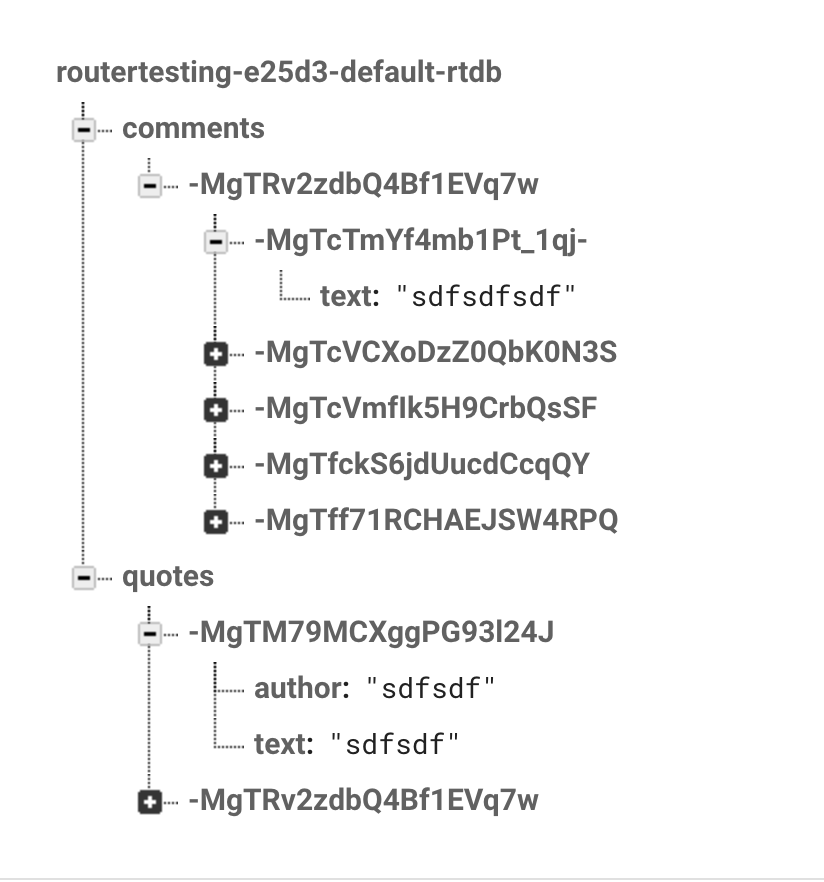

This is a small app I made for learning React-router.  
Live Demo: https://routertesting-e25d3.web.app/quotes

```js
// For install all the package
npm install

// For running on your local server
npm start
```

Because I used firebase for processing real-time data (making the API). So this is the structure of the API:


- Each quote will have their own ID (like **MgTM79MCXggPG93l24J**). Data in quote only includes _author_ and _text_
- Each comment will be associated with the quote ID they are in and they also have their own ID. Data of each comment is only _text_.
